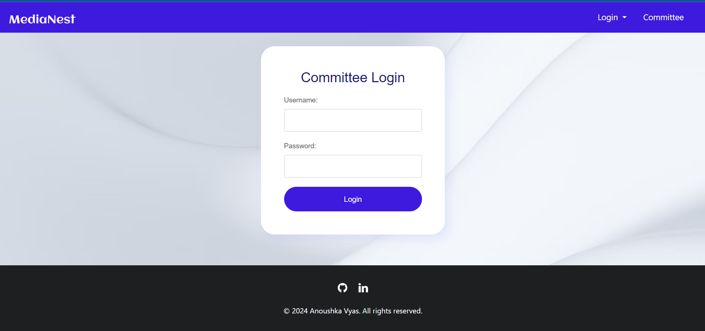

 Folder management system
- A folder management system built using PHP, mysql, javascript , bootstrap.
- Features include: .
  
 Committees/ clubs can :
- add/delete images, videos to folders and subfolders.
-	receive notifications about rejected items.
- send request to admin to restore items.
- download items of their choice.
  
Admin:
-	view uploaded items sorted by clubs/commitees .
- reject and approve items of their choice.
-	recieve notifications about folders added and requests to restore items.
-	download items of their choice.
  
End User:
-	has view access to all items uploaded by committee/clubs and are approved by admin.
-	download items of their choice.

Some Screenshots of the project:

Committee side:

Admin side:

User side:
